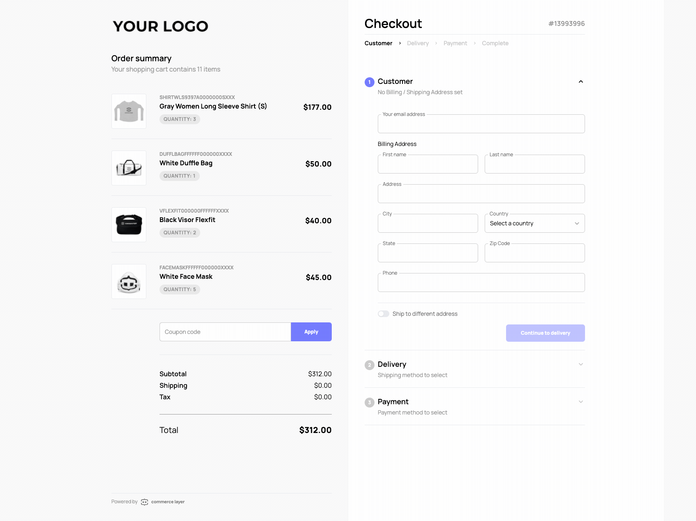
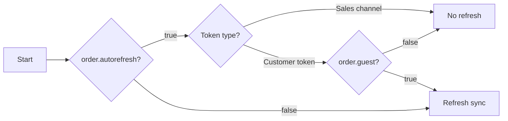

# Commerce Layer React Checkout

The Commerce Layer Checkout application (React) provides you with a [PCI-compliant](https://commercelayer.io/security), PSD2-compliant, and production-ready checkout flow powered by Commerce Layer APIs. You can fork this repository and deploy it to any hosting service or use it as a reference application to build your own.



## What is Commerce Layer?

[Commerce Layer](https://commercelayer.io) is a multi-market commerce API and order management system that lets you add global shopping capabilities to any website, mobile app, chatbot, wearable, voice, or IoT device, with ease. Compose your stack with the best-of-breed tools you already mastered and love. Make any experience shoppable, anywhere, through a blazing-fast, enterprise-grade, and secure API.

## Table of contents

- [Getting started](#getting-started)
- [Hosted version](#hosted-version)
- [Features](#features)
- [Contributors guide](#contributors-guide)
- [Help and support](#need-help)
- [License](#license)

---

## Getting started

1. Create your organization and get your credentials by following one of our [onboarding tutorials](https://docs.commercelayer.io/developers/welcome).

2. Set the environment variable `NEXT_PUBLIC_SLUG` on your hosting provider to your organization slug (subdomain) and be sure to build the forked repository using the node environment (`NODE_ENV`) as production.

3. Deploy the forked repository to your preferred hosting service. You can deploy with one click below:

[](https://app.netlify.com/start/deploy?repository=https://github.com/commercelayer/mfe-checkout#NEXT_PUBLIC_SLUG) [](https://vercel.com/new/clone?repository-url=https://github.com/commercelayer/mfe-checkout&build-command=pnpm%20build&output-directory=out/dist&env=NEXT_PUBLIC_SLUG&envDescription=your%20organization%20slug)

4. Build your sales channel with your favorite technologies and frameworks by leveraging our [developer resources](https://commercelayer.io/developers) and [documentation](https://docs.commercelayer.io/api).

5. Get an [access token](https://docs.commercelayer.io/api/authentication) for your application. You should generate this in your sales channel or use our JavaScript [authentication library](https://github.com/commercelayer/commercelayer-js-auth).

6. Create an [order](https://docs.commercelayer.io/developers/v/api-reference/orders) associated with some [line items](https://docs.commercelayer.io/developers/v/api-reference/line_items).

7. Checkout the previously created order using the URL format: `<your-deployed-checkout-url>/:order_id?accessToken=<your-access-token>`

### Example

`https://checkout.yourbrand.com/PrnYhoVeza?accessToken=eyJhbGciOiJIUzUxMiJ9`

## Hosted version

Any Commerce Layer account comes with a hosted version of the Checkout application that is automatically enabled. You can customize it by adding your organization logo, favicon, primary color, Google Tag Manager ID, support telephone, and email address.

You can use the hosted version of the Checkout application with the following URL format: `https://<your-organization-subdomain>.commercelayer.app/checkout/:order_id?accessToken=<your-access-token>`

### Example

`https://yourbrand.commercelayer.app/checkout/PrnYhoVeza?accessToken=eyJhbGciOiJIUzUxMiJ9`

### CLI plugin

If you are using [Commerce Layer CLI](https://github.com/commercelayer/commercelayer-cli), you can leverage the [checkout plugin](https://github.com/commercelayer/commercelayer-cli-plugin-checkout/blob/main/README.md) to generate the URL from an SKU code (using the `-S` flag), a bundle code (using the `-B` flag), or an order ID (using the `-O` flag):

```
commercelayer checkout -S <skuCode>:<quantity> --open
commercelayer checkout -B <bundleCode>:<quantity> --open
commercelayer checkout -O <orderID> --open
```

## Features

The Commerce Layer Checkout application supports most of the main features available through the Commerce Layer API. We're working to add a few missing ones within the next development iterations.

The Checkout application includes an [order summary](#order-summary) and a checkout flow made of 3 steps:

1. [Customer](#customer-step)
2. [Delivery](#delivery-step)
3. [Payment](#payment-step)

Each step can be edited by the customer at any time. The order status determines the current step, which stays consistent across sessions.

Once the checkout is successfully completed, the customer is redirected to a [thank you page](#thank-you-page).

### Order summary

The Checkout application shows a visual summary of the order that's about to be placed detailing all the involved line items (frequency of recurring items, order amounts, shipping costs, taxes, discounts, etc.).

> We suggest properly setting up all the [SKU](https://docs.commercelayer.io/developers/v/api-reference/skus) information (in terms of names and images) on the Commerce Layer admin dashboard or via API so that this part is fully populated.

#### SKU options

The Checkout application supports [SKU options](https://docs.commercelayer.io/developers/v/api-reference/sku_options). If a line item is associated with one or more [line item options](https://docs.commercelayer.io/developers/v/api-reference/line_item_options) the details are visible in the order summary. Line item option prices aren't displayed but they are included in the line item amount.

#### Gift cards and coupons

The Checkout application supports [gift cards](https://docs.commercelayer.io/developers/v/api-reference/gift_cards) and [coupon](https://docs.commercelayer.io/developers/v/api-reference/coupons) codes (just fill in the related field in the order summary). You can use a gift card or coupon to pay — in total or in part — for the order. A single gift card and a coupon code can also be used together to pay for the same order.

#### Bundles

The Checkout application supports [bundles](https://docs.commercelayer.io/developers/v/api-reference/bundles) and shows them as a single item both in the order summary and within the _Delivery_ step. The SKUs belonging to bundles may still be split across more than one shipment, based on their availability and the selected inventory model strategy.

#### Return to cart

If the order has the attribute `cart_url` set, a "Return to cart" link will be displayed.

### Order refresh

When the checkout is opening, after getting the organization settings, the order might be refreshed if some conditions are met. Check the flowchart below to better understand how this logic works:



### Customer step

Here is where customers provide their email address, billing and shipping information.

#### Logged customers

If the access token used to build the checkout URL is a [customer token](https://docs.commercelayer.io/developers/authentication/password) customers can select one of their saved addresses from their address book and use it as the billing and/or shipping address. If the customer has only one address in the address book the Checkout application will use this address as the billing and shipping address and skip the _Customer_ step.

#### Digital products

In the case of digital product purchases (i.e. SKUs with the `do_not_ship` flag enabled), the shipping address form doesn't appear.

#### Locking the shipping country code

If the order has the attribute `shipping_country_code_lock` set, customers can select only the specified country code in the shipping address form. If they select a different country for the billing address, the shipping address section will open automatically with the country code already selected and disabled.

#### Custom list of countries and states

You can configure a custom list of countries and/or states for billing and shipping address forms, along with specifying a default country preselected at the organization level of the Provisioning API. This can be achieved by setting the `config` attribute as follows:

```json
{
  "mfe": {
    "default": {
      "checkout": {
        "default_country": "IT",
        "billing_countries": [
          {
            "value": "ES",
            "label": "Espana"
          },
          {
            "value": "IT",
            "label": "Italia"
          },
          {
            "value": "US",
            "label": "Unites States of America"
          }
        ],
        "billing_states": {
          "US": [
            {
              "value": "CA",
              "label": "California"
            },
            {
              "value": "TX",
              "label": "Texas"
            }
          ],
          "IT": [
            {
              "value": "FI",
              "label": "Firenze"
            },
            {
              "value": "PO",
              "label": "Prato"
            },
            {
              "value": "LI",
              "label": "Livorno"
            }
          ]
        }
      }
    }
  }
}
```

In the example above, the billing form will have just three countries, custom provinces/states for Italy and USA, and the default country preselected (set to Italy) for both billing and shipping forms.

You can use `default_country`, `billing_countries`, `billing_states`, `shipping_countries` and `shipping_states` as keys. The option can also be customized per market in scope. You can read more about the organization config [here](https://docs.commercelayer.io/provisioning/api-reference/organizations#micro-frontends-configuration).


### Delivery step

Here is where customers select a shipping method for each shipment of their order. [External shipping cost](https://docs.commercelayer.io/core/external-resources/external-shipping-costs) are partially supported by the Checkout application at the moment.

#### Single shipping method

If there is only one available [shipping method](https://docs.commercelayer.io/developers/v/api-reference/shipping_methods) per shipment, the Checkout application will autoselect that shipping method for each shipment of the order and skip the _Delivery_ step.

#### Shipping zone check

If the shipping address is outside the associated [shipping zone](https://docs.commercelayer.io/developers/v/api-reference/shipping_zones) customers will receive an error and won't be able to place the order.

#### Out-of-stock items

If one of the items in the order is out of stock customers will get an error message and won't be able to place the order. If the order has the attribute `cart_url` set, the error message will contain a link to let them go back and edit the shopping cart.

#### Digital products

In the case of digital product purchases (i.e. SKUs with the `do_not_ship` flag enabled), this step doesn't appear.

### Payment step

Here is where customers select a payment method and place the order.

> We're working to make all the [payment gateways](https://docs.commercelayer.io/developers/v/how-tos/payments) supported by Commerce Layer available out-of-the-box in the Checkout application. [External payments](https://docs.commercelayer.io/developers/v/how-tos/payments/external-payments) are not supported by the Checkout application at the moment. For all the other gateways information please refer to the table below.

| Payment gateway                                                                               | Supported payment methods                                                                                                                               | Customer wallet |
| --------------------------------------------------------------------------------------------- | ------------------------------------------------------------------------------------------------------------------------------------------------------- | --------------- |
| [Adyen](https://docs.commercelayer.io/developers/v/how-tos/payments/adyen)                    | Credit card / [PayPal](https://docs.adyen.com/payment-methods/paypal/web-drop-in) / [Klarna](https://docs.adyen.com/payment-methods/klarna/web-drop-in) | &check;         |
| [Braintree](https://docs.commercelayer.io/developers/v/how-tos/payments/braintree)            | Credit card                                                                                                                                             | &check;         |
| [Klarna](https://docs.commercelayer.io/developers/v/how-tos/payments/klarna)                  | Klarna                                                                                                                                                  | &cross;         |
| [PayPal](https://docs.commercelayer.io/developers/v/how-tos/payments/paypal)                  | PayPal                                                                                                                                                  | &cross;         |
| [Stripe](https://docs.commercelayer.io/developers/v/how-tos/payments/stripe)                  | Credit card / Apple Pay / Google Pay / PayPal / Klarna                                                                                                  | &check;         |
| [Manual gateway](https://docs.commercelayer.io/developers/v/how-tos/payments/manual-payments) | Manual payment                                                                                                                                          | &cross;         |

> To automatically accept payment methods enabled in the Stripe dashboard please make sure to properly set up the `auto_payments` option on your [Stripe gateway](https://docs.commercelayer.io/core/v/api-reference/stripe_gateways).

> When using PayPal via Adyen please make sure to properly [set up third-party access](https://docs.adyen.com/payment-methods/paypal/web-drop-in#grant-api-access) on your PayPal first.

> Adyen Payments API supported by the Checkout application are from `v68` to `v71`. Make sure that your Adyen payment gateway is configured properly on Commerce Layer.

#### Logged customers

If the access token used to build the checkout URL is a [customer token](https://docs.commercelayer.io/developers/authentication/password) customers will see their saved credit cards in their customer wallet and will be able to reuse them to accelerate the payment process.

#### Single payment method

If there is only one [payment method](https://docs.commercelayer.io/developers/v/api-reference/payment_methods) available in the market the order belongs to, the Checkout application will autoselect that payment method and let you directly add your payment details to the order.

#### Zero-balance

In case the order balance is zero — e.g. the customer is paying with a gift card or coupon code for the full amount of the order — this step doesn't appear.

#### Privacy acceptance

If the `privacy_url` and `terms_url` attributes of the order are set an info paragraph will be displayed before the "Place order" button, including the related links and a checkbox to accept the terms. Customers won't be able to place the order unless they check it and agree.

### Order subscription

#### Recurring items

When a line item includes a frequency, placing the order [creates an order subscription](https://docs.commercelayer.io/core/v/how-tos/placing-orders/subscriptions/generating-the-subscriptions). To activate the subscription, the payment source must be saved in the customer's wallet. Therefore, during checkout with a customer token, the payment source is automatically saved. However, if a guest is checking out, they will receive an alert indicating that the subscription will not renew successfully without a saved payment source.

#### Target order 

If a customer's payment source has expired or been deleted, or if the order initiating the subscription was placed as a guest, the resulting target order will be `pending`. Upon placement, the payment source will be automatically saved in the customer's wallet, and the order subscription will be automatically updated with the new payment source.

### Thank you page

The page is displayed on successful order placement and features a recap of the order in terms of SKUs, bundles, billing/shipping addresses, and payment information. It is possible to show some support references (phone and email) by setting the `support_phone` and `support_email` attributes of the order. If the order's `return_url` attribute is set a link to continue shopping will be displayed on the page as well.

#### Custom thank you page URL

It is possible to provide a custom thank you page URL at the organization level of the Provisioning API by setting the `config` attribute, as follows:

```json
{
  "mfe": {
    "default": {
      "checkout": {
        "thankyou_page": "https://example.com/thanks/:lang/:order_id"
      }
    }
  }
}
```

You can use `:lang`, `:order_id` and `:access_token` as parameters that will be replaced with the values used by the Checkout. The option can also be customized per market in scope. You can read more about the organization config [here](https://docs.commercelayer.io/provisioning/api-reference/organizations#micro-frontends-configuration).

### Supported languages

The Checkout application language is set by the `language_code` attribute of the order. At the moment, languages supported out of the box are:

- English
- Italian
- German
- Polish
- Spanish
- French
- Hungarian
- Portuguese

> The fallback language is English.

If you want to contribute and translate the Checkout application into a language that's not currently available feel free to [create a PR](#contributors-guide).

### Google Tag Manager integration

If `gtm_id` attribute is set on the [organization](https://docs.commercelayer.io/developers/v/api-reference/organization/object) settings it will be used to send [Enhanced Ecommerce](https://developers.google.com/analytics/devguides/collection/ua/gtm/enhanced-ecommerce) events. The Checkout application currently tracks the following events:

- `begin_checkout`
- `add_shipping_info`
- `add_payment_info`
- `purchase`

If the _Delivery_ step is [automatically populated](#single-shipping-method), the `add_shipping_info` event will be fired as soon as the Checkout application sets the related shipping method. If the customer opens the _Delivery_ step from the UI and clicks on the "Continue to payment" button, the event will be fired once more.

## Contributors guide

1. Fork [this repository](https://github.com/commercelayer/mfe-checkout) (you can learn how to do this [here](https://help.github.com/articles/fork-a-repo)).

2. Clone the forked repository like so:

```bash
git clone https://github.com/<your username>/mfe-checkout.git && cd mfe-checkout
```

3. First, install dependencies and run the development server:

```bash
pnpm install
pnpm dev
```

4. Set your environment with `.env.local` starting from `.env.local.sample`.

5. Open [http://localhost:3000](http://localhost:3000) with your browser to see the result. You can use the following format to open the checkout: `http://localhost:3000/:orderId?accessToken=<your-access-token>`.

6. Make your changes and create a pull request ([learn how to do this](https://docs.github.com/en/github/collaborating-with-issues-and-pull-requests/creating-a-pull-request)).

7. Someone will attend to your pull request and provide some feedback.

## Need help?

1. Join [Commerce Layer's Slack community](https://slack.commercelayer.app).

2. Create an [issue](https://github.com/commercelayer/mfe-checkout/issues) in this repository.

3. Ping us [on Twitter](https://twitter.com/commercelayer).

## License

This repository is published under the [MIT](LICENSE) license.
